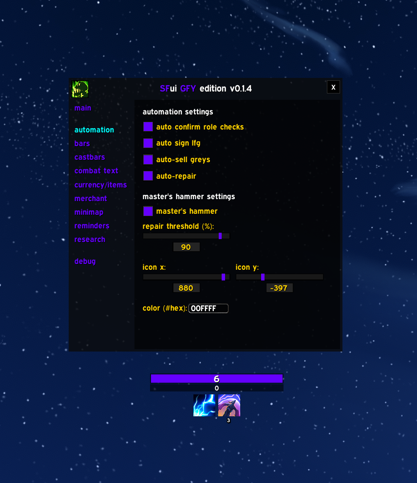
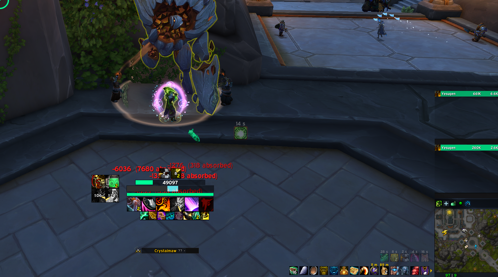
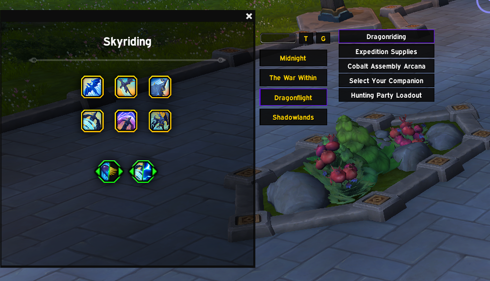

# sfui (beta)

Additions and helpers for the World of Warcraft UI.
Designed to replace lost WeakAuras and complex configurations.

## Overview
Modular, lightweight, and "set-and-forget" interface. Handles functionality that typically requires multiple addons. Focuses on clarity and automation.

Supports [Masque](https://www.curseforge.com/wow/addons/masque) for button skinning. Screenshots use [Masque: Caith](https://www.curseforge.com/wow/addons/masque-caith).

## Features

### Buffs and Reminders
Tracks out of combat raid buffs and personal consumables.
- Dynamically shows raidbuffs like Mark of the Wild, Evoker buffs, and Stamina based on group composition
- Smart filtering for your class and group
- Shift+Click to announce missing buffs

### Merchant Frame
Redesigned merchant interface with filtering and currency display.
- Ctrl+Click to preview items
- Shift+RightClick to buy stacks or max affordable
- Integrated housing decor filtering (can be disabled in options)

### Item Tracking
Track items, currencies, and cooldowns.
- Right-Click to remove items

*Standard Tracker*

### Player Status
Health, primary power, and secondary resources (Stagger, Runes, etc).

### Research
View talents, artifacts, and covenants directly in-game.

### Automation
Quality of life features to streamline daily tasks.
- **Auto Role Check**: Automatically accepts role checks.
- **Enhanced LFG**: Double-click groups in the LFG tool to sign up instantly.
- **Auto-Sell Greys**: Automatically sells grey items at vendors.
- **Auto-Repair**: Automatically repairs gear (prioritizing guild repairs).

### Vehicle and Dragonriding
Clean interfaces for vehicles and dragonriding.
- Improved visibility for vigor and speed

*Dragonflying HUD*

*Vehicle Interface*
