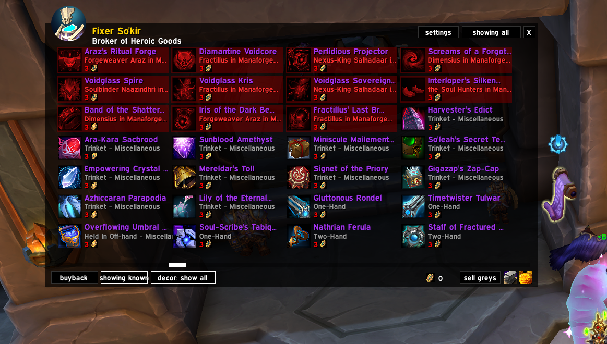
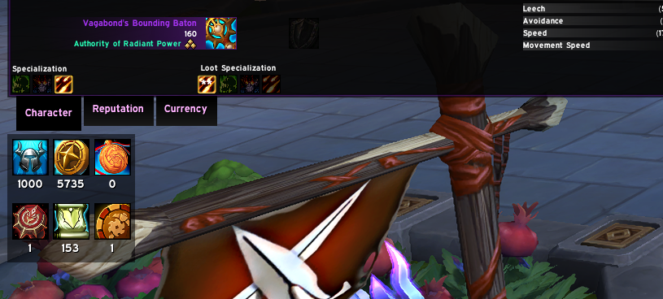
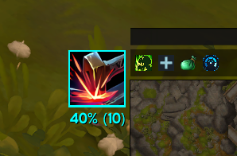
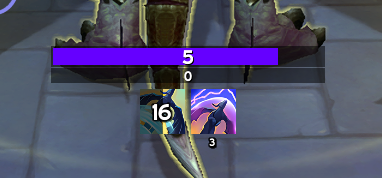
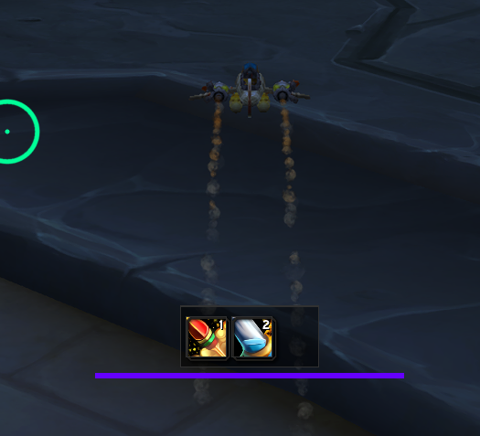

# sfui (beta)

Additions and helpers for the World of Warcraft UI.
Designed to replace lost WeakAuras and complex configurations.

## Overview
Modular, lightweight, and "set-and-forget" interface. Handles functionality that typically requires multiple addons. Focuses on clarity and automation.

Supports [Masque](https://www.curseforge.com/wow/addons/masque) for button skinning. Screenshots use [Masque: Caith](https://www.curseforge.com/wow/addons/masque-caith).

## Features

### Tracked Bars
Powerful cooldown and aura tracking system that integrates seamlessly with your character frame.
- **Smart Attachment**: Stack tracked bars directly above your Health or Secondary Power bar for a unified HUD.
- **Dynamic Layout**: Automatically adjusts positioning based on resource bar visibility, maintaining a clean interface.
- **Stack Mode**: Visualize stack counts as a progress bar or centered text for clarity.
- **Flexible Display**: Customize colors, text alignment, and visibility per ability.

### Merchant Frame
Redesigned merchant interface with filtering and currency display.
- Ctrl+Click to preview items
- Shift+RightClick to buy stacks or max affordable
- Integrated housing decor filtering (can be disabled in options)

### Item Tracking
Track items, currencies, and cooldowns.
- Right-Click to remove items

*Standard Tracker*

### Player Status
Health, primary power, and secondary resources (Stagger, Runes, etc).

### Research
View talents, archaeology, and profession trees directly in-game. Supports Skyriding, Delves, and expansion-specific research systems.

### Castbars
Enhanced cast visualization for both player and target.
- **Player Castbar**: Clean, high-fidelity bar with integrated **Instant Cast Tracking** (shows a quick highlight when instant spells are used). Supports Empowered (Evoker) spell stages with dynamic color shifting.
- **Target Castbar**: High-visibility bar positioned for better combat awareness. Distinct colors for interruptible vs. non-interruptible spells.

### Automation
Quality of life features to streamline daily tasks.
- **Auto Role Check**: Automatically accepts role checks.
- **Enhanced LFG**: Double-click groups in the LFG tool to sign up instantly.
- **Auto-Sell Greys**: Automatically sells grey items at vendors.
- **Auto-Repair**: Automatically repairs gear (prioritizing guild repairs). Automatically skips if you have a Master's Hammer to prevent wasting durability.
- **Master's Hammer System**: When damaged gear is detected and a hammer is in your bags, a large context-sensitive popup appears. 
    - **Sequential Rotation**: Each click or keybind press repairs the next item in the list (Priority: Weapons/Shields -> Plate Armor).
    - **Spam Proof**: Advances the target immediately on click, allowing you to spam all repairs in a single GCD window without double-casting.
    - **Keybind Support**: Can be bound to a single key via the WoW Bindings menu (SFUI -> Master's Hammer Repair).

### Vehicle and Skyriding
Clean interfaces for vehicles and current flight systems.
- Improved visibility for vigor and speed
- Terminology updated for modern Skyriding systems

*Skyriding HUD*

*Vehicle Interface*
