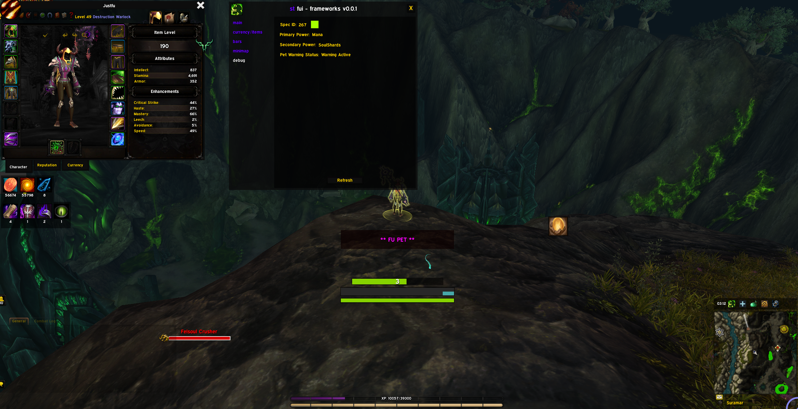
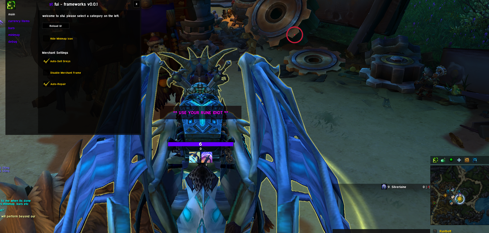

# sfui (beta)

Additions and helpers for the World of Warcraft UI.
Designed to replace lost WeakAuras and complex configurations.

## Overview
Modular, lightweight, and "set-and-forget" interface. Handles functionality that typically requires multiple addons. Focuses on clarity and automation.

## Features

### Buffs and Reminders
Tracks out of combat raid buffs and personal consumables.
- Smart filtering for your class and group
- Shift+Click to announce missing buffs

### Merchant Frame
Redesigned merchant interface with filtering and currency display.
- Ctrl+Click to preview items
- Shift+RightClick to buy stacks or max affordable
- Integrated housing decor filtering

### Item Tracking
Track items, currencies, and cooldowns.
- Right-Click to remove items

*Standard Tracker*

### Player Status
Health, Primary Power, Secondary Power, Stagger, etc.

### Research
View talents, artifacts, and covenants directly in-game.

### Vehicle and Dragonriding
Clean interfaces for vehicles and dragonriding.
- Improved visibility for vigor and speed

*Dragonflying HUD*

*Vehicle Interface*
