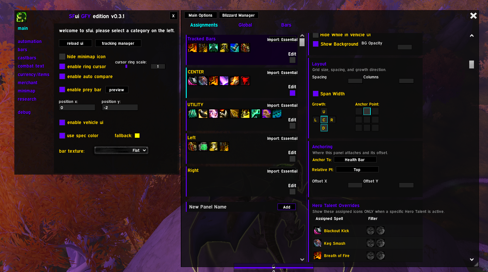
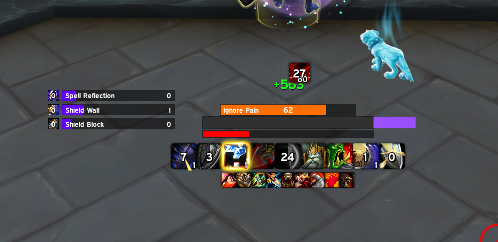
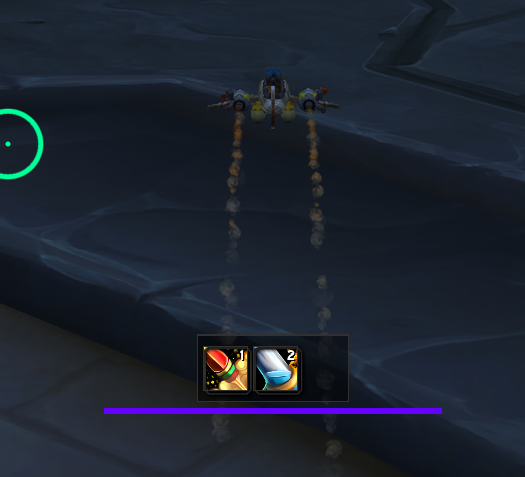
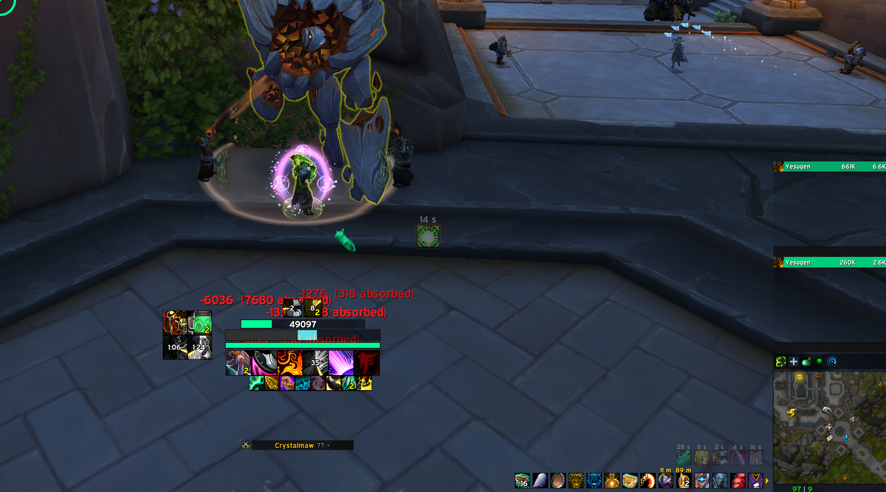
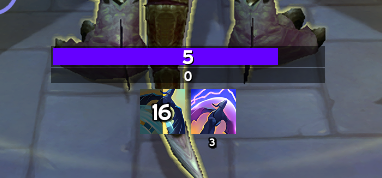
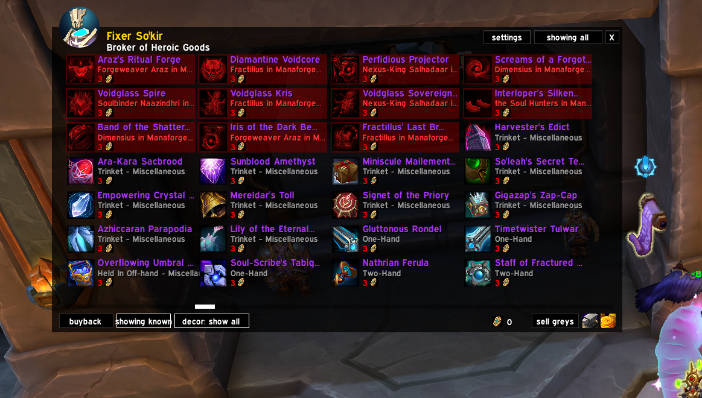
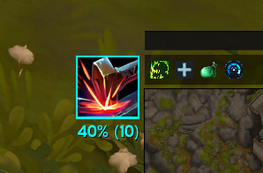

# sfui

Modular, high-performance UI suite and quality-of-life additions for World of Warcraft (Retail & Classic / Forever).

Designed to replace bloated addon suites, complex WeakAuras, and heavy frameworks with clean, minimalist, zero-allocation native components.

---

## Architectural Principles

- **Zero Taint**: 100% compliant with Blizzard's protected frames, combat lockdown boundaries, and secure execution paths. No `ADDON_ACTION_BLOCKED` errors in Mythic+, Delves, or Raids.
- **Zero Allocation Churn**: Frame recycling pools (`rowPool`), table recycling (`wipe()`), pre-computed string lookup tables (LUTs), and in-place indicator updates eliminate garbage collection spikes and micro-stutters.
- **Zero Idle Overhead**: All background update loops use centralized, throttled event scheduling (`sfui.events.RegisterUpdate`) that automatically unregisters and sleeps when frames are hidden or inactive (0 CPU).
- **Multi-Client Support**: Seamless compatibility across modern Retail (12.x / Midnight / The War Within) and Classic Forever / Beta (1.60.x).
- **Button Skinning**: Full support for [Masque](https://www.curseforge.com/wow/addons/masque) (e.g. *Masque: Caith*).

---

## Features

### Modular Options Framework (`/sfui`)
A tabbed, search-enabled options panel built with native flat minimalism.
- **14 Dedicated Tabs**: `main`, `automation`, `bars`, `castbars`, `combat text`, `currency/items`, `fishing`, `gear swapper`, `merchant`, `minimap`, `objectives`, `pets`, `research`, and `debug`.
- **Keyboard Friendly**: Integrated into `UISpecialFrames` for seamless `ESC` key closing without opening the game menu.

---

### Companion Pet Manager (`/sfpet`, `/sfui pet`)
A companion pet manager designed for collectors and immersion.
- **Auto-Summon & Restoration**: Automatically re-summons your active companion after dismounting, flight paths, vehicle exits, deaths, delves, and zone transitions.
- **Timed Rotation**: Cycles through your favorite companions on a customizable timer (default 12 minutes) without memory allocation.
- **Competitive Suppression**: Automatically pauses companion summoning during Mythic+ dungeons, Raids, Arenas, and while stealthed, flying, or channeling.
- **Favorites & Exclusions**: Direct drag-and-drop integration from the Pet Journal, character-specific favorite lists, and aura protection (e.g. Daisy backpack, Brewfest rams).

---

### Fishing Automation (`/sffish`, `/sfui fish`)
Lightweight fishing automation.
- **Single-Key & Double-Right-Click Automation**: Casts when idle and reels in/interacts with the bobber when a bite occurs, with built-in mouselook protection and deferred combat lockdown handling.
- **Dynamic Soft-Targeting**: Automatically manages interact CVars for effortless bobber interaction without precise mouse targeting.
- **Acoustic Audio Enhancement**: Dynamically boosts SFX volume during casts to amplify bobber splash audio, while temporarily muting ambient sound and background music.
- **Auto-Arming**: Arms casting bindings automatically on fishing pole equip.

---

### Quest Log & Objective Tracker (`/sfql`, `/sfquestlog`)
A zero-taint, modular objective tracker engine replacing Blizzard's default tracker.
- **Modular Domains**: Dedicated tracking modules for Retail quests, Camelot zone quests, Delves/Scenarios, World Events, Tracked Achievements, Traveler's Log activities, and Crafting Recipes.
- **Raid & Boss Suppression**: Clean, zero-taint suppression preventing the default Blizzard tracker from popping up during raid encounters and Delves.
- **Usable Quest Items**: Integrated action buttons with range checking, charge counters, cooldown sweeps, and blob highlight pulses.
- **Group Finder Integration**: 1-click LFG eye buttons to search or form groups for quests and world quests without taint.
- **Timer Bars & Waypoints**: Countdown progress bars and directional turn-in guidance.

---

### Gear Manager & ILvl Optimizer (`/sfui gear`, `/sfui highest`)
Automated gear recommendation, stat weight evaluation, and equipping engine.
- **Auto-Equip Engine**: Detects bag upgrades and equips items based on role, primary stat shifts, and customizable stat weights.
- **Tier Set Prioritization**: Ranks candidate tier sets by newest tier, evaluating 4-set and 2-set bonuses before raw item level.
- **Frost DK Dual-Wield Heuristics**: 80% threshold favoring dual-wielding over two-handed weapons, ensuring higher-DPS weapons are equipped in the Main Hand.
- **Role-Based Trinket Policies**: Enforces strict trinket access based on class roles (tank, healer, DPS) with zero tooltip scraping.
- **Slot Locking & Profiles**: Lock specific trinkets, rings, or weapons from being replaced; separate PvE and PvP profiles.

---

### Encounter Journal Loot Browser & Spec Swapper (`/sfloot`, `/sfui lv`)
A fast loot browser and specialization manager.
- **Loot Browser**: Standalone dungeon and raid encounter browser with slot filtering, search, and spec toggles.
- **Secondary Stat Highlights**: Icon border coloring for Haste, Crit, Mastery, and Versatility for rapid upgrade evaluation.
- **Loot Spec Swapper**: 1-click spec override buttons attached directly to loot frames and character panels.

---

### Tracking Manager & Tracked Bars (`/sfui cv`)
Event-driven aura, proc, and cooldown tracking anchored directly to player status frames.
- **Out-of-Combat Animation**: Bars smoothly complete their expiration animations when combat ends and dynamically enter a zero-CPU sleep state when idle.
- **Layout Modes**: Stack mode, progress bar mode, or icon grid with customizable color grading and typography.
- **Instant Event Sync**: Direct hooks to `BuffBarCooldownViewer` and real-time combat log events.

---

### Cooldown Manager (CDM)
A dynamic scrolling tracker to monitor important active auras, procs, and cooldowns.

---

### Vehicle & Possess HUD
A combat-safe vehicle interface driven exclusively by secure state drivers.
- **Unified Stack**: Aligns with player coordinates, featuring a **Vehicle Castbar**, **Vehicle Health Bar**, and **Vehicle Power Bar**.
- **Action Buttons**: 6 styled action buttons with range/usable tinting and Masque support.
- **Auto-Suppression**: Hides player health, power, and cooldowns while in vehicles or possess mode.

*Vehicle Interface*

---

### Player Status & Class Resources
Health, primary power, and secondary resources (Runes, Stagger, Devourer Fragments, Combo Points, etc.) with class/spec color inheritance.

---

### Skyriding HUD
Streamlined interface for dragonriding / skyriding flight systems with vigor indicators and mount speed tracking that dynamically sleeps when grounded.

*Skyriding HUD*

---

### Castbars
Enhanced cast visualization for player and target.
- **Player Castbar**: Clean statusbar with instant-cast flash highlights and Evoker empowered spell stages.
- **Target Castbar**: High-visibility bar with distinct interruptible vs. non-interruptible styling.

---

### Portals & Teleports (`/sfui portals`)
An organized UI for quick access to all character teleport toys, spells, and hearthstones, categorized by expansion and location.
- **Dungeon Portal Auto-Popup**: Automatically offers the relevant dungeon portal when forming or joining a Mythic+ group.
- **Cosmetic Hearthstone Carousel**: Cycles through collected hearthstone skins with character persistence.

---

### Alts Manager & Great Vault (`/sfalts`, `/alts`)
Track alternate characters' item levels, lockouts, weekly activities, currencies, profession cooldowns, and Great Vault reward progress across your Warband.

---

### Merchant & Vendor Automation
Redesigned merchant interface with currency display and automated convenience features:
- `Ctrl + Click` to preview items
- `Shift + RightClick` to buy full stacks or max affordable quantity
- 1-click auto-selling of grey trash items
- Automated gear repair (prioritizing guild bank repairs)
- Housing decor item filtering

---

### Master's Hammer Repair Automation (`/sfui hammer`)
Sequential repair popup supporting multi-expansion blacksmith repair hammers (Midnight, The War Within, Dragonflight) with keybind support.

---

### Memory Profiler & Pool Diagnostics (`/sfmem`, `/sfui mem`)
An interactive diagnostic GUI accessible via `/sfmem` or the options **debug** tab.
- **Live Telemetry**: Real-time memory allocation rates (`KB/s`), live GC metrics, and allocation benchmark runs.
- **Universal Module Registry**: Live inspection of active frame pools, table pools, and cache sizes across **all 30 addon modules**.
- **On-Demand Garbage Collection**: One-click memory purging and cache resetting.

---

## Slash Commands Reference

| Command | Alias | Description |
| :--- | :--- | :--- |
| `/sfui` | | Opens the main SFUI options configuration panel |
| `/sfui help` | | Displays all available slash command routes |
| `/sfmem` | `/sfui mem`, `/sfui gc` | Opens the Memory Profiler GUI or runs manual GC (`/sfmem gc`) |
| `/sfpet` | `/sfui pet` | Toggles Pet Manager or summons/rotates active companion |
| `/sffish` | `/sfui fish` | Runs 1-key fishing cast/reel-in or resets sound defaults (`/sffish sound`) |
| `/sfql` | `/sfquestlog`, `/sfui ql` | Toggles the custom Objective Tracker HUD |
| `/sfalts` | `/alts`, `/sfui alts` | Opens the Alts & Warband character dashboard |
| `/sfui gear` | | Toggles the Gear Manager interface |
| `/sfui highest` | | Displays highest item-level upgrade recommendations |
| `/sfloot` | `/sfui lv`, `/sfui lootspec` | Opens the Encounter Journal Loot Browser & Spec Swapper |
| `/sfui portals` | `/sfui portal` | Opens the Portals & Teleport Toys matrix (`/sfui portals test`) |
| `/sfui cv` | | Opens the Cooldown and Tracking Manager |
| `/sfui hammer` | `/sfui repair` | Shows Master's Hammer status, repositioning, or preview (`test`, `lock`, `reset`) |
| `/sfui mythic` | `/sfui m+` | Shows or hides the Mythic+ / Delve HUD preview |
| `/rl` | `/sfui rl` | Rapidly reloads the World of Warcraft user interface |

---

## Keybindings

Configure keybindings directly in **Game Menu -> Options -> Keybindings -> SFUI**:
- **Cast & Catch Fishing** (`SFUI_FISHING` / `BETTERFISHINGKEY`)
- **Summon / Rotate Companion Pet** (`SFUI_PET_SUMMON`)
- **Toggle Pet Manager** (`SFUI_PET_MANAGER`)
- **Master's Hammer Repair** (`SfuiHammerPopup`)
- **Portals Hub** (`SFUI_PORTALS`)
- **Alts & Warband Viewer** (`SFUI_ALTS`)
- **Loot Browser** (`SFUI_LOOTVIEWER`)
- **Match Target Mount** (`SFUI_MATCHMOUNT`)
